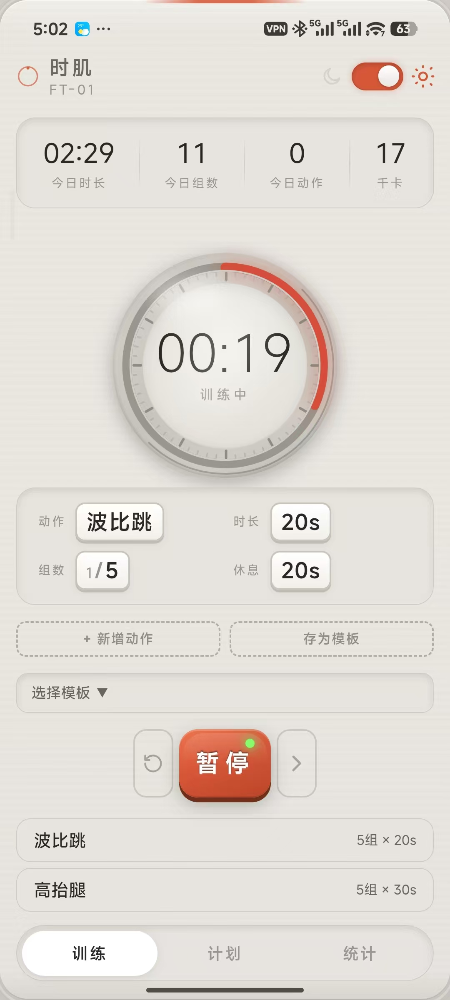
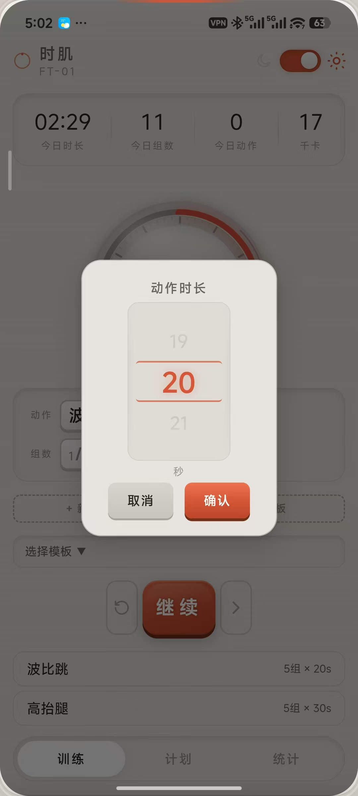
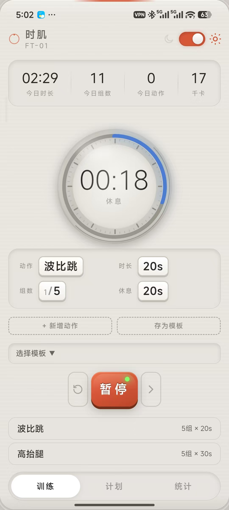
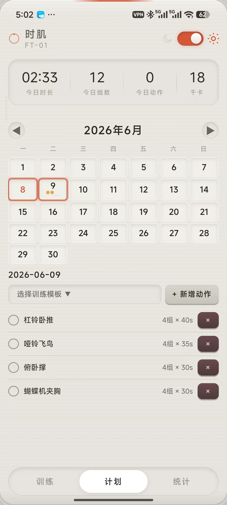
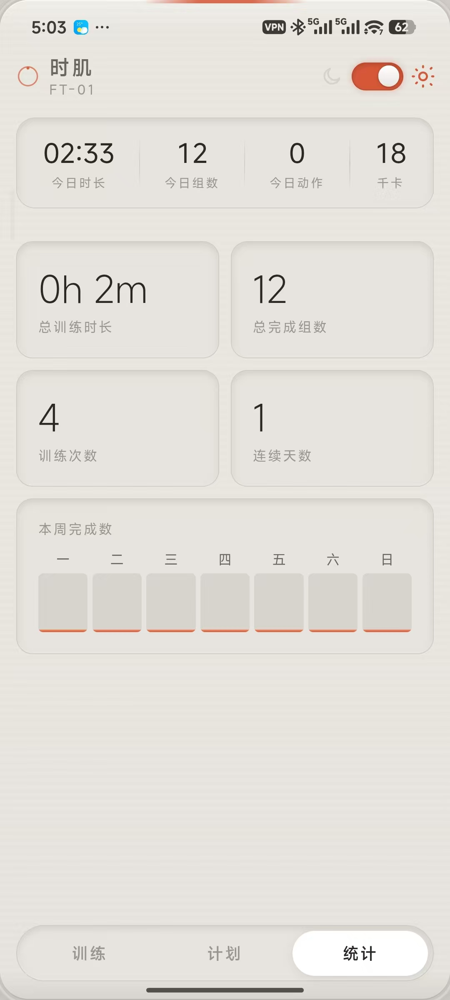

# 时肌 (Shi Ji) -- 健身计时器

一款设计精致的健身计时器 Web 应用，模拟机械表盘的交互体验。

## 截图

| | | |
|------|------|------|
|  |  |  |
|  |  |  |
|  |  |  |

## 功能

- **表盘倒计时**：拟物表盘 UI，红色倒计时环，满圈刻度
- **训练计划**：60+ 预设动作，20 个训练模板，日历计划
- **组数循环**：动作 x 组数 x 休息，自动循环
- **走时音效**：轻柔机械表滴答声
- **拖拽排序**：长按动作条目自由调整顺序
- **日月主题**：一键切换暗色/亮色模式
- **自适应字号**：小/中/大三档调节

## 使用方式

### 浏览器
直接用 Chrome 打开 `index.html`，F12 切手机模式即可预览。

### 打包为 Android APK

```bash
npm install @capacitor/core @capacitor/cli @capacitor/android sharp
npx cap init "时肌" "com.shiji.timer" --web-dir www
mkdir www && cp index.html tick.mp3 www/
npx cap add android
# 用 sharp 将 icon.svg 转为各密度 PNG
npx cap sync android
cd android && ./gradlew assembleDebug
```

## 项目结构

```
├── index.html      # 主程序（单文件 HTML + CSS + JS）
├── icon.svg        # 应用图标
├── tick.mp3        # 走时音效
└── README.md
```

## 技术栈

纯前端，零依赖运行。打包使用 Capacitor + Android SDK。

## 作者

谭人玮

## 版本

v6.5 · 2026-06-08
