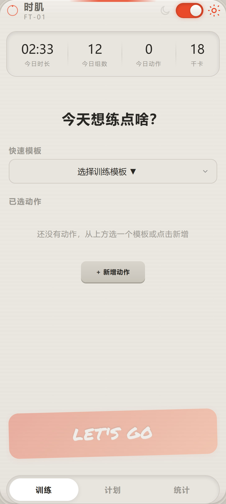
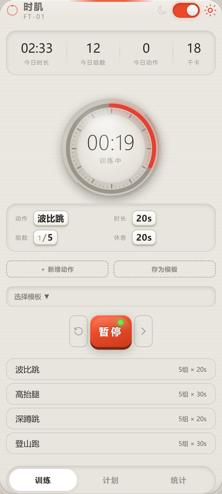
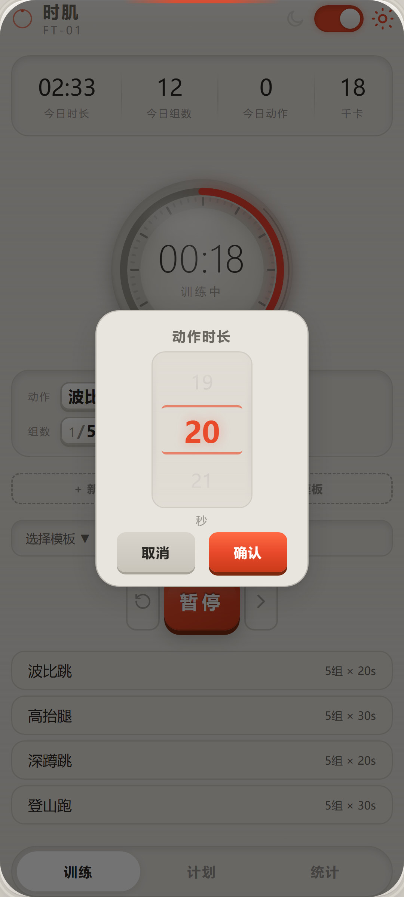
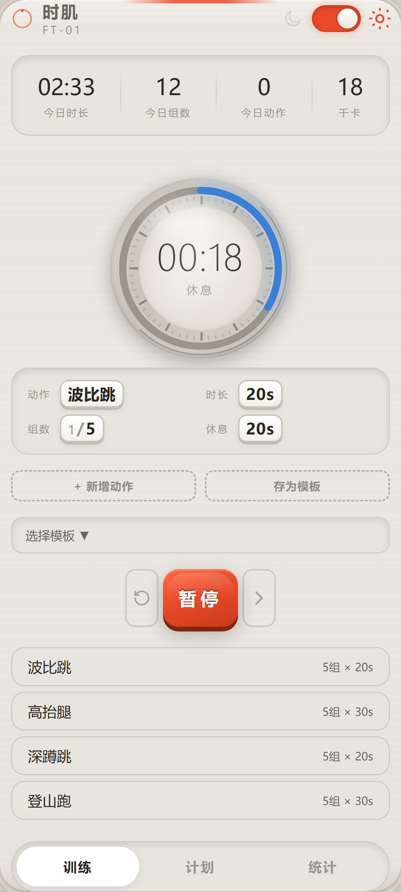
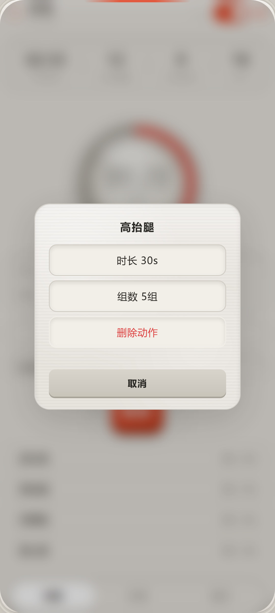
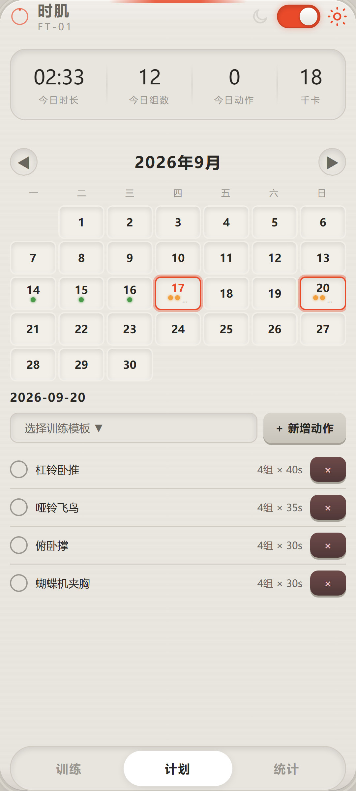
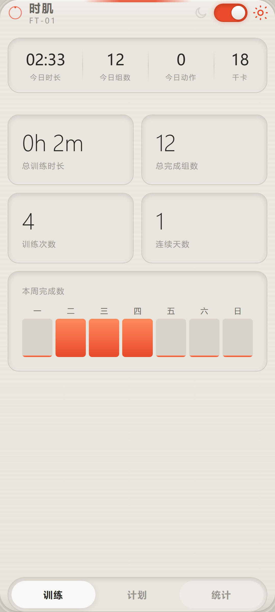

# 时肌 (Shi Ji) -- 健身计时器

一款设计精致的健身计时器 Web 应用，模拟机械表盘的交互体验。

## 截图

| | | |
|------|------|------|
|  |  |  |
|  |  |  |
|  |  |  |

## 下载安装

### Android

手机直接下载 [release/时肌7.2.apk](release/时肌7.2.apk) 安装即可（首次安装需允许「安装未知来源应用」）。

### 浏览器

用 Chrome 打开 `index.html`，F12 切手机模式即可预览。

## 功能

- **表盘倒计时**：拟物表盘 UI，红色倒计时环，满圈刻度
- **组间连续计时**：一组练完自动进入休息，休息结束直接开始下一组，全程可暂停 / 跳过
- **走时音效**：机械表滴答声，可开关，音量低 / 中 / 高三档可调
- **训练计划**：60+ 预设动作，20 个训练模板，日历排期
- **拖拽排序**：长按动作条目自由调整顺序
- **日月主题**：一键切换暗色 / 亮色模式
- **自适应字号**：小 / 中 / 大三档调节

## 使用方式

### 浏览器
直接用 Chrome 打开 `index.html`，F12 切手机模式即可预览。

### 打包为 Android APK

```bash
npm install @capacitor/core @capacitor/cli @capacitor/android sharp
npx cap init "时肌" "com.shiji.timer" --web-dir www
mkdir www && cp index.html tick.mp3 www/
npx cap add android
# 用 sharp 将 icon.svg 转为各密度 PNG
npx cap sync android
cd android && ./gradlew assembleDebug
```

## 项目结构

```
├── index.html      # 主程序（单文件 HTML + CSS + JS）
├── icon.svg        # 应用图标
├── tick.mp3        # 走时音效
├── release/        # 已打包的 Android 安装包
├── screenshots/    # 界面截图
└── README.md
```

## 技术栈

纯前端，零依赖运行。打包使用 Capacitor + Android SDK。

## 更新日志

- **v7.2** 设置里新增「走时音量」低 / 中 / 高三档，选完即时试听
- **v7.1** 计时页统计栏与表盘整合为一体，整块一起滚动
- **v7.0** 组间自动连续计时（休息结束直接开下一组）；音效内联进单文件，休息阶段静音
- **v6.5** 修复跳过组数计数器

## 作者

谭人玮

## 版本

v7.2 · 2026-09-17
